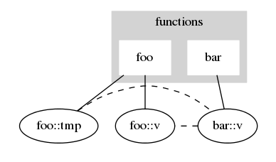
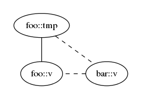
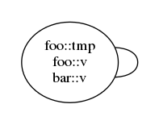
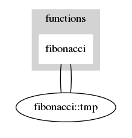
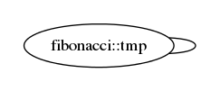

# Variable allocation

Variable allocation for any given memory arena is solved with graph coloring.

## Generation 1 graph (with "alias" edges and function vertices):

* For each function:
 * Add a function vertex.
 * For each local variable:
  * Add a var vertex.
  * Add an edge from the var vertex to the function vertex.
 * For each parameter:
  * Add a var vertex.
  * Add an edge from the var vertex to the function vertex.

* For each function call:
 * For each active variable (local and parameter) that's not a function argument:
  * Add an edge to the function.
 * For each argument:
  * Add an alias edge from the argument var vertex to the corresponding parameter var vertex.

Note: it's possible for the graph to have multiple edges on function -- var vertices.
The Generation 2 graph will give the var vertex a self loop in this case.

## Generation 2 graph (minor of Generation 1 graph):

* 2a) Contract function vertices
 * If a function-var pair has multiple edges, then the var vertex will inevitably have a self loop.
* 2b) Contract alias edges

What we're left with is a graph with one type of vertex and one type of edge.

## Validation

If the graph can be colored, then there are no variable allocation errors.

In other words, the graph must have no loops and the chromatic number must be
less than or equal to the size of the memory arena.

### Cases when variable allocation errors can occur

If any set of functions recursively depend on a variable, the resulting graph
will contain a loop. Besides running out of memory, this is the only case when
allocation errors can occur.

#### Recursive use of variables

```
fn foo(v: u8 <- zp) -> A {
    let tmp: u8 <- zp;
    bar(tmp)
}

fn bar(v: u8 <- zp) -> A {
    if v == 0 {
        foo(v)
    } else {
        0:A
    }
}
```

##### Generation 1

##### Generation 2a

##### Generation 2b


The Generation 2 graph contains a vector with a self loop, which is an error.

The issue is that `foo::tmp` is effectively aliased to `foo::v`, which would
result in a shared memory address between the two variables.
No parameter can be aliased to any local variables within the function.

```
// 1 1 2 3 5 8 13...
#[invariant(X)]
fn fibonacci(n: X) -> A {
    if n > 2 {
        let tmp1: u8 <- zp;
        let tmp2: A;
        n = n - 1;
        tmp1 = fibonacci(n);    // tmp1 lifetime starts here (after function call)...
        n = n - 1;
        tmp2 = fibonacci(n);
        n = n + 2;

        tmp2 + tmp1             // ...and ends here.
    } else {
        1:A
    }
}
```

##### Generation 1

##### Generation 2

